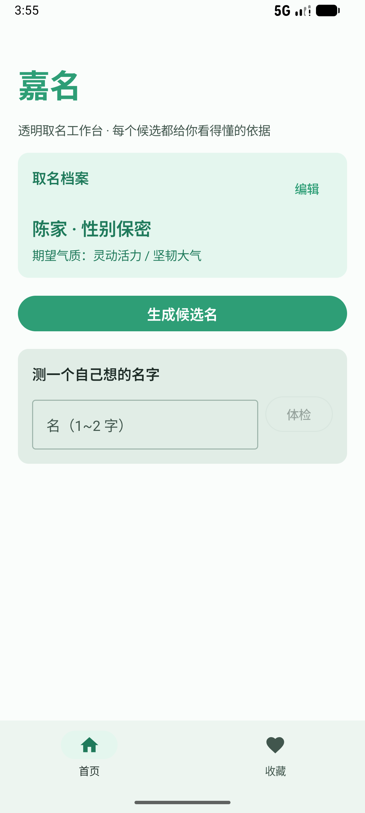
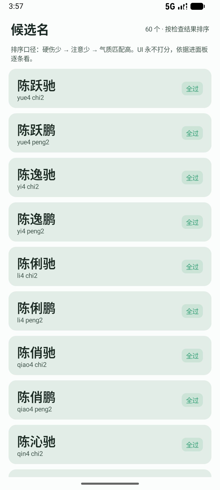
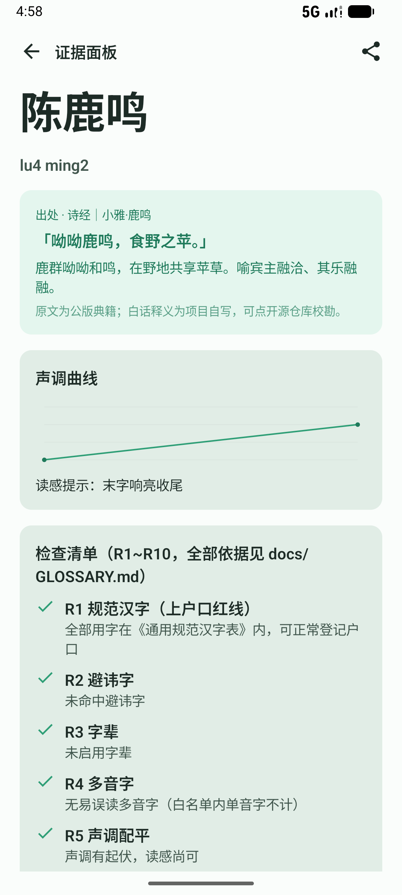
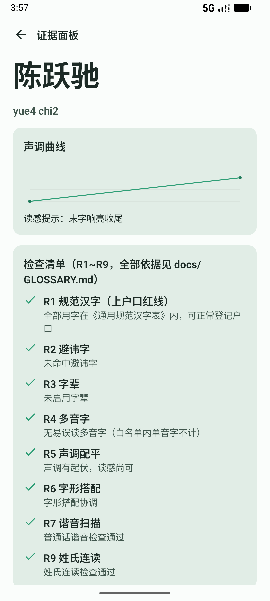
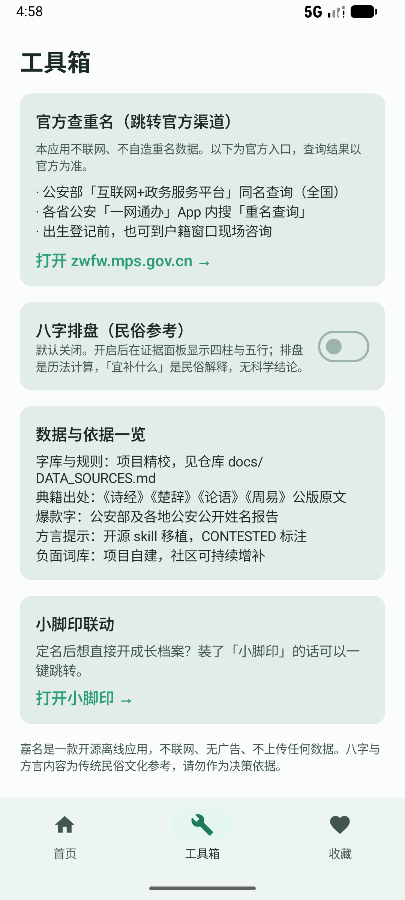

# 嘉名 JiaMing · 开源中文取名工作台

一款 Android 端、**离线优先、完全开源、无广告**的中文取名 App。它不给你打分，而是帮你理清取名的全部约束、生成有据可查的候选名、并帮全家达成共识。

<p>
  
  
  
  
  
</p>

## 为什么做这个

市面上的取名 App 有三个通病：

1. **打分玄学**——几乎所有产品都用「三才五格」给名字打 95 分以上，然后卖你解锁报告。而五格剖象法是日本运命学家熊崎健翁 1918 年前后发明的，1929 年成书系统化，1936 年才经台湾传入，**1918 年之前的中国典籍里零记载**。本项目明确拒绝五格打分（原因与出处见 [docs/GLOSSARY.md](docs/GLOSSARY.md)）。
2. **名字同质化**——生成器推来推去都是当年爆款字，三年后全班三个「沐宸」。
3. **忽略真实决策**——取名最终是全家的事：夫妻意见、长辈的方言、发家庭群征求意见。没有产品管这一段。

嘉名的答案：**用「证据面板」取代「分数」**。每个候选名展示它通过了哪些检查、依据是什么、踩了哪些雷，全程可溯源。

## 核心特性

- **R1~R10 十条检查规则**，全部展示依据，永不静默淘汰：
  - 硬约束：通用规范汉字表（上户口红线）、避讳字、字辈
  - 语言学：多音字、声调配平、字形搭配、普通话谐音扫描、姓氏连读特检
  - 官方数据：近五年新生儿爆款名/字降权（公安部及各地公安公开报告）
  - 家乡话：10 种主要方言的雷区提示（诚实标注置信度，建议请长辈核实）
- **三路候选生成**：典籍取词（诗经/楚辞/论语/周易，带原文与自写白话）→ 期望标签组字 → 字库组合
- **家庭共识**：夫妻双设备各自收藏、导出/导入文件合并、共同喜欢视图、家人意见登记、定名标记
- **可选民俗模块**（默认关闭，开启需阅读免责）：八字排盘（lunar 库确定性历法计算 + 扶抑流派标注）
- **分享卡片**：证据面板一键导出长图发家庭群
- **官方查重名聚合**：只跳转官方渠道，不自造数据
- **纯本地**：全程不申请网络权限，出生日期、籍贯等敏感信息不出设备

## 设计原则（三条）

1. **事实与观点分离**：确定性事实（规范字表、拼音笔画、公版典籍、官方统计）与语言学规则构成核心引擎；民俗、命理全部降级为带 `CONVENTION / CONTESTED` 标注的可选模块。核心功能不依赖任何命理知识。
2. **透明取代分数**：引擎内部有排序权重（代码可审计），UI 永不显示数字分。
3. **本地优先**：无 `INTERNET` 权限；分享与协作走系统分享与文件导出导入。

## 构建

```bash
# 要求：Android Studio（或 Android SDK 35 + JDK 17+）
git clone https://github.com/benyichan/jiaming.git
cd jiaming
./gradlew assembleDebug        # 产物：app/build/outputs/apk/debug/app-debug.apk
./gradlew testDebugUnitTest    # 黄金用例测试（16 个，与生产数据同源）
```

## 数据可信度分层

| 层级 | 内容 | 标注 |
|---|---|---|
| L1 事实 | 规范汉字表、字音笔画、公版典籍原文、官方姓名统计 | `FACT` |
| L2 语言学 | 声调/字形/谐音规则，每条配测试正反例 | 工程规则 |
| L3 文化惯例 | 避讳、字辈、出处标签 | `CONVENTION` |
| L4 命理解释 | 八字排盘（历法计算）、扶抑倾向（流派分歧） | `CONTESTED` + 免责 |

每条数据在 App 内可查看来源。详见 [docs/DATA_SOURCES.md](docs/DATA_SOURCES.md)。

## 贡献

数据贡献（新增典籍条目、方言雷区、负面词）必须附来源——PR 请按 [CONTRIBUTING.md](docs/CONTRIBUTING.md) 的模板填写。也可以直接跑数据校验：

```bash
python scripts/build_data.py   # 校验字库/词表/典籍/方言数据一致性与格式
```

## License

代码与自建数据：MIT。典籍原文为公版。上游数据各自遵循其原始协议，逐项见 [docs/DATA_SOURCES.md](docs/DATA_SOURCES.md)。

---
*「肇锡余以嘉名」——《离骚》。项目名取自屈原，愿你给孩子的名字，经得起查证。*
